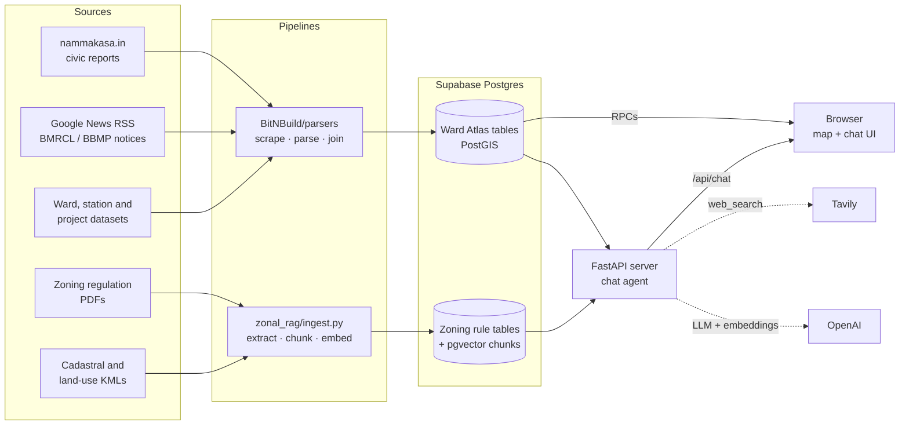

# BnB — Bengaluru civic and planning data

**[Try it live →](https://bit-n-build-nine.vercel.app/web/map.html)**

### The problem

Information about Bengaluru's wards is scattered. Civic complaints sit on
community reporting sites, zoning rules are buried in long government PDFs, and
metro and road updates appear only in the news. The 2025 ward redraw means older
datasets no longer match today's boundaries. A resident cannot easily find out
what is happening in their ward, who is responsible, or what can be built there.

### How we're solving it

We collect these sources, clean them and join them into one database keyed to
the 369 wards of 2025. The Ward Atlas shows the result on a map, ward by ward. A
chat assistant answers questions in plain English and cites the regulation page
or map location behind each answer. Each ward can be downloaded as a PDF report,
and a WhatsApp button lets residents file a complaint directly.

### Why Bangalore?

The approach works for any city or state whose data is scattered online. The
AI-assisted pipeline does not depend on any particular source: it turns whatever
it collects into dense vectors for retrieval or into tables for SQL. We chose
Bengaluru because we know the city and can check its data ourselves, which makes
the cleaning more thorough and the results more accurate.

## Features

### Ward Atlas map

- **369 GBA wards**, shaded by any of nine metrics: total or unresolved civic
  reports, reports per sq km, reports per 1,000 residents, civic pressure score,
  allowed building height, population, population density or area.
- **A ward panel** with tabs for civic reports (itemised where the source lists
  them), civic status, people and area, representatives (MLA and MP with
  photographs) and what lies inside the ward.
- **126 metro stations**, with lines, status, opening dates and recent news, and
  each line's route drawn in order.
- **16 road projects** (flyovers, underpasses, elevated corridors, tunnel
  roads), with authority, cost, length, expected completion and news.
- **Ward search** by name, and a **sortable table view** of every ward.
- **Shareable links** for any view: `?ward=`, `?station=`, `?project=`,
  `?metric=`, `?view=table` and `?theme=light|dark`.
- **Light and dark themes.**
- **Works without the database.** If Supabase is not configured, the map reads
  the data files committed to the repository.

### Acting on the data

- **Downloadable ward report (PDF)** with the ward's headline figures,
  priorities, civic reports, population, zoning, representatives and GBA
  contact, metro stations, road projects, related news and live web results.
- **Contact on WhatsApp** button, which opens WhatsApp with a garbage complaint
  already filled in.

### Chat assistant

- **Plain-English answers** from the database, in two modes: **Map** (wards,
  rankings, reports, stations, projects, "what is near this point") and
  **Zoning** (planning regulations).
- **Zoning figures come from rule tables** covering permitted uses, FAR,
  setbacks, heights, parking, ground coverage, minimum plot size and density,
  with a link to the exact page of the source PDF.
- **Map answers link into the map.** Clicking a ward, station or project in an
  answer opens it on the map without reloading.
- **Optional live web search** (Tavily) for current news.
- **Conversations are saved in the browser**, with example questions for each
  mode and a status line showing whether the server is ready.

### Data pipelines

- **Civic reports** scraped from nammakasa.in and parsed into per-ward counts
  and itemised reports.
- **Metro and road news** gathered from Google News RSS and official BMRCL, BBMP,
  GBA and BDA notices, and tagged with the stations or projects they mention.
- **Dataset joining** across three sets of ward boundaries from different years,
  fixing swapped coordinates, duplicate stations, metro route order and missing
  ward areas.
- **Zoning ingestion**, which extracts rule tables from regulation PDFs with an
  LLM, splits the text into 2,629 searchable, embedded clauses, and converts
  cadastral and land-use KML maps to GeoJSON.

## How it fits together



There are two data pipelines, **BitNBuild** and **zonal_rag**. Each fills its
own tables in one shared Supabase database, and the tables do not overlap. A
small FastAPI server sits between the browser and the database. It serves the
web app and runs the chat agent. The OpenAI and Tavily keys stay inside that
server and never reach the browser.

---

## 1. Ward Atlas: the civic map

### What the map shows

- **Wards**, shaded by a choice of metric: total or unresolved civic reports,
  reports per sq km, reports per 1,000 residents, a civic pressure score,
  allowed building height, population, population density or area.
- **A ward panel** with the ward's figures, zoning class and height band,
  primary concerns, and its elected MLA and MP with photographs.
- **Metro stations**, with their lines, status, opening dates and recent news.
  Each line's route is drawn in running order.
- **Road projects** (flyovers, underpasses, elevated corridors, tunnel roads),
  with their authority, cost, length, expected completion date and news.
- **A table view** of the same data, which can be sorted and compared.

Every view has its own URL. For example `?ward=1:42`, `?station=cubbon_park`
and `?metric=reportDensity` each open the map in that state. The chat agent
uses these same URLs for the map links it puts in its answers.

### The pipeline

```
nammakasa.in ──scrape_nammakasa.py──> things.html ──parse_things.py──> things.json ──┐
Google News  ──parser.py ────────────────────────────────────────────> news.json ────┤
Google News  ──parser_road.py ───────────────────────────────────────> road_news.json┤
ward / station / project / representative datasets ─────────────────────────────────┤
                                                                                      ▼
                                                                      build_map_data.py
                                                                                      │
                                                          wards.geojson + points.json
                                                                                      │
                                                    load_supabase.py ──> Supabase (PostGIS)
```

- **Civic reports** are scraped from nammakasa.in with headless Selenium, then
  parsed into per-ward counts and itemised reports.
- **News** comes from two parsers that poll Google News RSS and official
  BMRCL, BBMP, GBA and BDA notice pages. One follows metro lines and stations;
  the other follows named road projects. Each item is tagged with the stations
  or projects it mentions.
- **`build_map_data.py`** joins every source into two files. One holds each
  ward's polygon with all its attributes; the other holds each station and
  project with its news. It uses only the Python standard library.
- **`load_supabase.py`** loads those two files into PostGIS tables. The map
  reads them back through RPCs. The same two files are also committed to the
  repository, so the map can still run from them if the database is unavailable.

### Joining datasets that disagree

The ward data comes from three different sets of ward boundaries, drawn in
different years. What holds it together is the key `(corporation_id, ward_id)`:

| Source | Records | Joined by |
|---|---|---|
| GBA 2025 ward boundaries (GeoJSON) | 369 wards, geometry | — |
| Civic database | 369 wards | `(corporationId, wardId)`, exact match |
| nammakasa reports | 351 wards | `(zone, ward_number)` |
| 243-ward MP/MLA list | 243 wards | ward name, partial match (123) |
| 198-ward BBMP census | 198 wards | ward name, partial match (104) |

The two older datasets fill in extra fields only where a ward name matches.

Problems in the source data that the build fixes:

- **Swapped coordinates.** The GBA ward file stores points as `[lat, lng]`,
  the reverse of the GeoJSON standard. The build swaps them back.
- **Leftover geometry.** 19 wards also carry a stray line from the KML export
  they came from. The build keeps only the polygons.
- **Duplicate stations.** Majestic and RV Road are each listed once per line.
  The build merges each into a single station that serves both lines.
- **Metro route order.** The source lists each interchange station only under
  its first line. Filtering by line alone therefore puts interchanges in the
  wrong place: the Pink line jumped 6.6 km at MG Road. The build instead
  inserts each interchange wherever it adds the least path length.
- **No data versus zero.** 18 wards are missing from the report dataset. They
  are shown as "No data", which is kept separate from a ward with zero reports.
- **No ward area.** The ward layer has no area field, so areas are calculated
  from the polygons. The per-sq-km metrics depend on them.
- **Name variants.** Representatives' names are matched to photographs after
  removing honorifics, punctuation and case. The build writes the matches to
  a lookup file, so the browser never has to match names itself.

---

## 2. zonal_rag: the zoning ingestion engine

`zonal_rag/ingest.py` reads Bengaluru's planning regulations and turns them
into data the chat agent can query. It processes a fixed set of documents:

| Document | Status | Produces |
|---|---|---|
| RMP 2015 Zonal Regulations | in force | rule tables + text chunks |
| Model Building Byelaws 2017 | in force | text chunks |
| Stilt parking and height amendment, Jul 2025 | final | height rules + text chunks |
| Setback amendment, Jan 2026 | final | setback rules + text chunks |
| Draft versions of both amendments | superseded | text chunks, for context |
| Proposed amendment, Jun 2026 | not yet in force | text chunks |
| BBMP cadastral map (~70 MB KML) | — | parcel GeoJSON |
| KSRSAC 2017 land-use maps | — | land-use GeoJSON |

The pipeline turns the documents into three kinds of output:

**Rule tables.** A regulation PDF is read page by page with pdfplumber. Groups
of pages are sent to `gpt-5.4-mini`, with a prompt that includes the JSON
schema of the table being extracted. The model returns rows in metric units,
each with the page it came from. Rows are validated against pydantic models,
and malformed ones are dropped. The results fill eight tables: permitted uses,
FAR, setbacks, heights, parking, ground coverage, minimum plot size and
density. Rows from the amendments go into the same tables and are told apart
by their `source_id`.

**Text chunks.** The regulation text is split at numbered clause boundaries
(`2.1`, `3.16.i`, …) using regular expressions; clauses that are too long are
split again at paragraph breaks. Each chunk is tagged by section (definitions,
TDR provisions, fire safety and so on) using keyword matching. No LLM is
involved in chunking. Each chunk is then embedded with
`text-embedding-3-small` and stored in pgvector. In total there are 2,629
chunks, searchable through the `match_rag_chunks()` RPC.

**Spatial layers.** The KML files are converted to GeoJSON. The 70 MB cadastral
file is read as a stream (`lxml.etree.iterparse`) rather than loaded into
memory all at once. One dataset page bundles four land-use layers as files with
the same extension, so the right layers are picked by resource name.

Design decisions:

- **Links to the exact page.** Every rule row and text chunk records its source
  document and page. `pdf_link(source_id, page)` turns that into a URL ending
  in `#page=N`, which browsers' built-in PDF viewers open at that page. This is
  what lets the chat cite the page it used.
- **Placeholder data is always flagged.** If a document cannot be downloaded or
  yields nothing usable, the pipeline generates placeholder data instead, so the
  rest of the run still works. Every placeholder row is marked
  `is_synthetic = true`, and the chat agent must say so if it uses one.
- **Safe to re-run.** Each run deletes and re-inserts only the rows for the
  source it is processing, so rows from other sources in the same table are
  never touched.

---

## 3. The database

One Supabase Postgres database, with two extensions: **PostGIS** for the map's
spatial queries and **pgvector** for searching the regulation text. The schema
is created by three migration files:

| Migration | Creates |
|---|---|
| `001_zoning_rag.sql` | pgvector, the zoning rule tables, `rag_chunks`, `sources`, `match_rag_chunks()`, `pdf_link()` |
| `002_ward_atlas.sql` | PostGIS, the ward, station, line, project and news tables, the import functions and the RPCs the map reads |
| `003_chat_api.sql` | spatial and ranking RPCs for the agent: `ward_at_point`, `stations_near`, `projects_in_ward`, `ward_search`, `ward_rank`, … |

Row-level security keeps browser clients read-only. Only the server and the
pipelines hold the key that can write.

---

## 4. The chat agent

`server/agent.py` runs a tool-calling loop on `gpt-5.4-mini`. Each turn, the
model decides which tools to call, reads their results, and either calls more
tools or answers. A turn is capped at six rounds of tool calls.

The chat has two **modes**, chosen with a toggle in the UI. The mode decides
which tools the model is given:

| Mode | Tools |
|---|---|
| Zoning | `zoning_rules` (the 8 rule tables), `zoning_search` (vector search over the text), `zoning_sources` |
| Map | `ward_lookup`, `ward_rank`, `ward_reports`, `ward_at_point`, `stations_near`, `station_lookup`, `projects_in_ward` |
| Both | `web_search` (Tavily), for current news and background information only |

How the agent is designed:

- **Each mode only sees its own tools.** In map mode the model never sees the
  zoning tools, and the reverse. Any call to a tool outside the current mode is
  refused. If a question belongs to the other mode, the agent tells the user to
  switch, rather than giving an unsourced answer from the web.
- **Numbers come from tables, not text search.** Vector search is poor at
  finding exact figures. So any question about FAR, setbacks, heights and so on
  goes to the rule tables, and text search is kept for wording and definitions.
- **Every figure comes from a tool result.** The system prompt forbids
  estimating or filling in figures from memory. It also spells out the known
  gaps in the data (wards with no reports, stations outside the ward layer,
  placeholder rows) so the model reports them instead of hiding them.
- **Answers carry links.** Zoning answers cite a PDF link to the exact page.
  Map answers include links that open the ward, station or project on the map.
- **The model never writes SQL.** Table and metric names are checked against
  fixed lists in `server/tools.py`, and every other input is passed as a query
  parameter. Spatial questions go through PostGIS RPCs.
- **The server keeps no conversation state.** Conversations are stored in the
  browser, which sends the whole thread with each message.

---

## Tech stack

| Layer | Tools |
|---|---|
| Data collection | Python, requests, Selenium, BeautifulSoup, feedparser |
| Document extraction | pdfplumber, lxml, fastkml, pydantic |
| LLM and embeddings | OpenAI `gpt-5.4-mini`, `text-embedding-3-small` |
| Database | Supabase Postgres, PostGIS, pgvector |
| Server | FastAPI |
| Frontend | Plain HTML and JavaScript with Leaflet; no build step |
| Web search | Tavily |

## Repository layout

```
BitNBuild/
  parsers/        scrapers, news parsers, build_map_data.py, Supabase loader
  data/           source datasets and MLA/MP photographs
  output/         generated map data (wards.geojson, points.json, news)
  web/            map.html and chat.js
zonal_rag/
  ingest.py       entry point; the list of source documents
  extractors/     downloaders, PDF/KML parsing, LLM table extraction, chunking, DB writes
  schemas/        pydantic models for rule rows and text chunks
server/
  app.py          FastAPI app: static files, /api/chat, /api/health, /api/ward-report
  agent.py        system prompt and tool-calling loop
  tools.py        tool implementations and the schemas shown to the model
  report_pdf.py   builds the downloadable ward report PDF
  fonts/          DejaVu Sans, embedded in the PDF, with its license
migrations/       SQL for the shared database
```

## Running locally

You need Python 3.12. The map works on its own, from the data files committed
in `BitNBuild/output/`. The chat also needs a Supabase project and an OpenAI
key; a Tavily key is optional and only enables web search.

```bash
# 1. install dependencies
python -m venv .venv
.venv/Scripts/python -m pip install -r requirements.txt   # macOS/Linux: .venv/bin/python

# 2. add credentials (OpenAI, Supabase, Tavily)
cp .env.example .env

# 3. run the server from the repo root
python -m uvicorn server.app:app --port 8000
```

Then open <http://localhost:8000/web/map.html>. If the chat tab is disabled,
<http://localhost:8000/api/health> lists the credentials the server could not
find.

To fill your own Supabase database, first run the SQL files in `migrations/`
in numbered order, using the Supabase SQL editor. Then install the pipeline
dependencies and load the data:

```bash
.venv/Scripts/python -m pip install -r requirements-pipeline.txt
python BitNBuild/parsers/load_supabase.py    # ward, station and project data
python BitNBuild/parsers/make_web_config.py  # makes the map read from Supabase
cd zonal_rag && python ingest.py             # zoning pipeline; downloads documents and calls OpenAI
```

## Known limitations

- Only 4 of the 369 wards have itemised civic reports. The others have
  headline counts only.
- 12 metro stations, including Electronic City, Bommasandra and the airport
  stations, lie outside the ward boundaries, so they have no ward.
- The two older ward datasets overlap only partly with today's wards, so MP
  names and census fields are missing for some wards.
- LLM table extraction is not guaranteed to be complete. It can miss a row from
  a long table, and nothing checks the extracted rows against the source.
